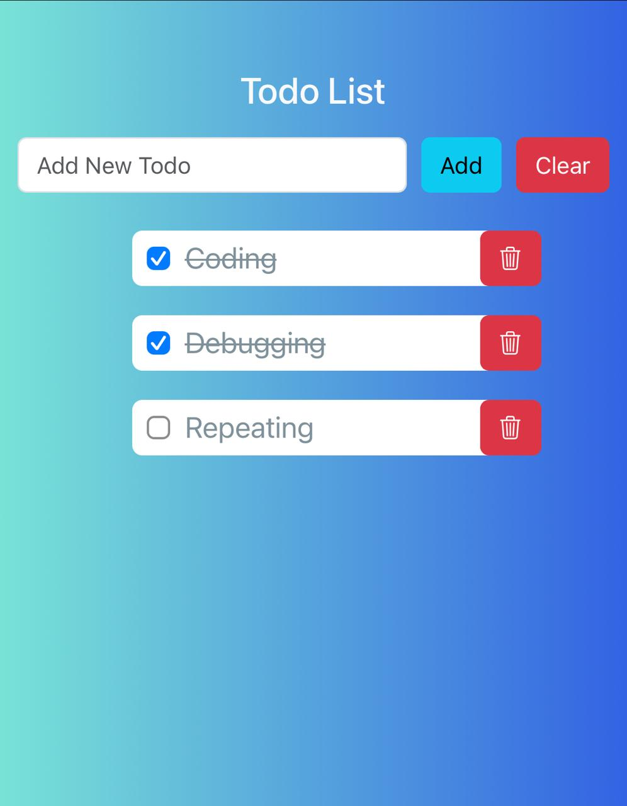

# 📝 **Stylish To-Do App**

Welcome to the **Stylish To-Do App**, a minimal yet feature-rich task management application! Organize your tasks, mark them as complete, and keep track of everything in style. 💼✨

---

## 🎯 **Features**
- ✅ Add tasks with ease.
- 🔄 Mark tasks as complete or incomplete.
- 🗑️ Delete tasks with a single click.
- 💾 Data persistence with `localStorage`.
- 🎨 Stylish UI with interactive feedback.

---

## 📷 **Preview**

_Stay organized and productive in a visually appealing way!_

---

## 🚀 **How to Use**
1. **Add a Task**: Enter your task in the input field and hit "Add" or press Enter.
2. **Mark as Complete**: Check the box next to a task to mark it as completed.
3. **Delete a Task**: Click the 🗑️ button to remove unwanted tasks.
4. **Clear Input**: Use the "Clear" button to reset the input field.

---

## 🌟 **Tech Stack**
- **HTML5**: Structuring the app.
- **CSS3**: Adding styles and responsive design.
- **JavaScript**: Core functionality and interactions.
- **localStorage**: For saving your tasks.

---

## 💡 **Highlights**
- ✨ **Dynamic UI**: Automatically updates when you add, delete, or toggle tasks.
- 🔒 **Persistence**: Your tasks remain even if you refresh the page.
- 🎉 **Accessibility**: Simple to use for everyone.

---

## 🛠️ **Future Enhancements**
- 🌈 Add dark mode for night owls.
- 📅 Integrate deadlines for tasks.
- 🔔 Notifications for due tasks.

---

## 💬 **Feedback**
We would ❤️ to hear your thoughts!  
Feel free to reach out with feedback or suggestions to make this app even better. 🚀  
